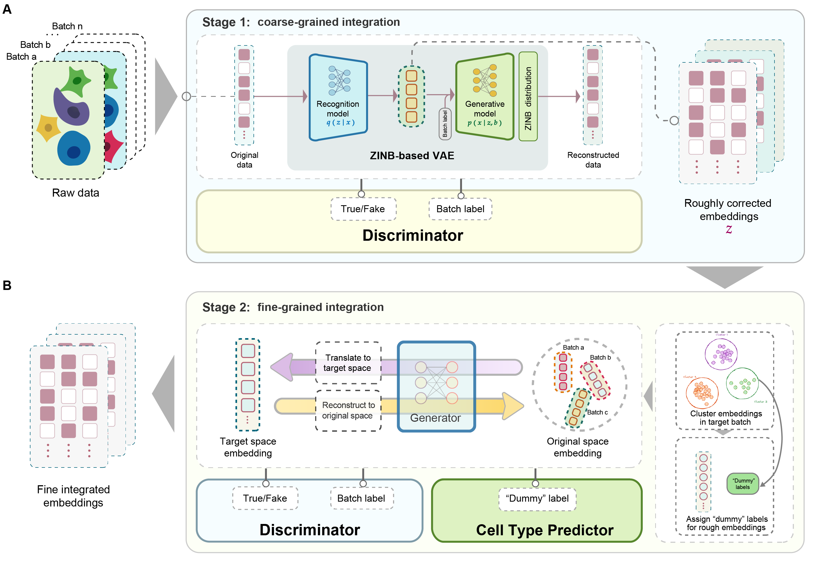

.. scintGAN-tutorial documentation master file, created by
   sphinx-quickstart on Sat May 11 00:29:02 2024.
   You can adapt this file completely to your liking, but it should at least
   contain the root `toctree` directive.

Welcome to scintGAN-tutorial's documentation!
=============================================

``scintGAN`` is a two-stage generative adversarial network-based model for single-cell data integration. 

scintGAN mainly contains two steps to model the general and specific batch effects respectively. By modeling different types of batch effects in different stages, scintGAN can project cells to an embedding space in which the distance between cells reflects the biological variance not batch effects. 

In modeling process of scintGAN, batch effects are divided into two categories: intra-technology and inter-technology. The intra-technology batch effect within single-cell technologies is a type of random error or deviation, with significant variation across different datasets. These are termed general batch effects. Conversely, the inter-technology batch effect occurs between different single-cell technologies, each with its own sequencing biases that could be considered a particular preference or style. 

scintGAN handles the general and specific batch effects with two stages respectively, which avoid over-correction and conserve the biological variance. Considering efficacy, efficiency, and generalization, scintGAN is expected to be widely used on different types of data sets and enhance biological knowledge discovery.

For more details, please see scintGAN manuscript.

To get started with ``scintGAN``, check out the `installation guide <install.rst>`__ and `tutorials <tutorials.rst>`__.

For more details about the GLUE framework, please check out our manuscript.

.. toctree::
   :maxdepth: 2
   :caption: Contents:

   install
   tutorials
   data
   reproduce

Indices and tables
==================

* :ref:`genindex`
* :ref:`modindex`
* :ref:`search`
